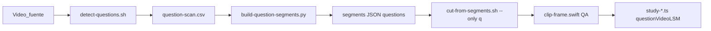

# Clips de pregunta LSM (`questionVideoLSM`)

Pipeline para generar los clips cortos de pregunta señada a partir del video fuente LSM de un estudio. La cantidad de clips no es fija: se deriva de `questionLabels` en la configuración del estudio. Los scripts viven en [`scripts/lsm/`](../../../scripts/lsm/) — no duplicar en esta carpeta.

## Regla crítica

Un clip de pregunta es **exactamente** el tramo donde aparece el círculo gris con **`?`** en la esquina **inferior-derecha** (presentador señando la pregunta).

**Prohibido** usar como proxy:
- Referencias bíblicas en top-left (ej. "Proverbios 18:24")
- Cambios de número de párrafo en top-left
- Inicios de párrafo sin icono `?`

Errores frecuentes y diagnóstico: [`references/pitfalls.md`](references/pitfalls.md).

## Prerrequisitos

- Video fuente local (no commitear), ej. `~/Downloads/w_LSM_*.mp4`
- macOS con `swiftc`, `python3`, **`avconvert`** (ffmpeg opcional)
- `studyId` conocido (ej. `2026-06-29`)
- `scripts/lsm/study-configs/{STUDY_ID}.json` para cualquier estudio que no siga el default legacy
- `scripts/lsm/segments-{STUDY_ID}.json` con `paragraphs[]` (párrafos ya detectados o en curso)
- Carpeta destino: `public/videos/study-{STUDY_ID}/`

## Pipeline



### Variables

```bash
export STUDY_ID="2026-06-29"
export SOURCE="/path/to/w_LSM_source.mp4"
export SEGMENTS="scripts/lsm/segments-${STUDY_ID}.json"
export OUT_DIR="public/videos/study-${STUDY_ID}"
```

### Configuración por estudio

Antes de detectar o recortar preguntas, confirmar la configuración del estudio:

```json
{
  "studyId": "2026-07-06",
  "expectedParagraphCount": 18,
  "questionLabels": ["1-2", "3", "4", "...", "18"],
  "joinedParagraphs": [[1, 2]]
}
```

`questionLabels` es la fuente de verdad para `questions[]`, nombres de archivo y conteos de QA.

| Label | Archivo |
|-------|---------|
| `"1"` | `study-${STUDY_ID}-q01-lsm.mp4` |
| `"18"` | `study-${STUDY_ID}-q18-lsm.mp4` |
| `"1-2"` | `study-${STUDY_ID}-q1-q2-lsm.mp4` |
| `"12-13"` | `study-${STUDY_ID}-q12-q13-lsm.mp4` |

Regla de conteo: clips esperados de pregunta = `questionLabels.length`. No asumir 12, 17 ni 18.

### 1. Detectar tramos y actualizar JSON

```bash
bash scripts/lsm/detect-questions.sh "$SOURCE"
```

`detect-questions.sh` usa por defecto `STUDY_ID=2026-06-29`, pero acepta variables de entorno:

```bash
STUDY_ID="$STUDY_ID" \
SEGMENTS="$SEGMENTS" \
CALIBRATE_SECOND=18 \
bash scripts/lsm/detect-questions.sh "$SOURCE"
```

Equivalente manual:

```bash
swiftc -O -o scripts/lsm/detect-question-icon \
  scripts/lsm/detect-question-icon.swift \
  -framework AVFoundation -framework AppKit

scripts/lsm/detect-question-icon "$SOURCE" scripts/lsm/question-scan.csv 18
python3 scripts/lsm/build-question-segments.py scripts/lsm/question-scan.csv "$SEGMENTS"
```

No usar `scripts/lsm/build-segments.py` para `questionVideoLSM`. Ese script es legacy: crea `questions[]` con OCR/`br > 500` cerca de párrafos y puede detectar intro, referencias bíblicas o cambios de párrafo en vez del icono `?`.

`build-question-segments.py` toma los tramos detectados por icono `?` y asigna labels desde `questionLabels`; si el número de tramos no coincide con la config, revisar calibración, CSV o límites manuales antes de recortar.

### 2. Recortar clips de pregunta

```bash
rm -f "${OUT_DIR}"/*q*.mp4   # obligatorio si re-recortas (cut-from-segments omite existentes)
bash scripts/lsm/cut-from-segments.sh "$SEGMENTS" "$SOURCE" --only q:all
```

Recorte parcial:

```bash
bash scripts/lsm/cut-from-segments.sh "$SEGMENTS" "$SOURCE" --only q:12-13
```

`q:all` recorta una vez por cada label de `questionLabels`. Los rangos parciales (`q:N` o `q:N-M`) se interpretan contra los números impresos y el mapeo de labels: si existe `"12-13"`, pedir `q:12` o `q:12-13` genera el mismo archivo `q12-q13`.

### 3. QA visual

```bash
swiftc -O -o scripts/lsm/clip-frame scripts/lsm/clip-frame.swift \
  -framework AVFoundation -framework AppKit

scripts/lsm/clip-frame "${OUT_DIR}/study-${STUDY_ID}-q01-lsm.mp4" /tmp/q01-qa.png
# Debe verse el ? en esquina inferior-derecha
```

También se puede correr `STUDY_ID="$STUDY_ID" bash scripts/lsm/qa-audit-clips.sh` para extraer `start.png`, `mid.png`, `end.png` y `report.csv` de todos los clips del estudio. Importante: `qa-audit-clips.sh` **no genera contact sheets**; si hacen falta láminas comparativas, hay que armarlas aparte desde esos PNG o revisar las carpetas directamente.

## Tabla de scripts

| Script | Entrada | Salida | Propósito |
|--------|---------|--------|-----------|
| `detect-question-icon.swift` | `SOURCE.mp4`, CSV, `[calibrateSecond]` | `question-scan.csv` | Escanea cada 0,5 s buscando `?` en bottom-right |
| `detect-questions.sh` | `SOURCE.mp4`; env `STUDY_ID`, `SEGMENTS`, `CSV`, `CALIBRATE_SECOND` opcionales | CSV + JSON actualizado | Compila, escanea, fusiona y valida duraciones 3–25 s |
| `build-question-segments.py` | CSV, `segments.json` | `questions[]` en JSON | Fusiona tramos consecutivos; asigna labels desde `questionLabels` |
| `build-segments.py` | `dump-scan.csv` | `paragraphs[]` + `questions[]` legacy | Solo orientación/arranque de párrafos; no usar sus `questions[]` para `questionVideoLSM` |
| `cut-from-segments.sh` | JSON, `SOURCE`, `[--only q:N-M]` | `q*.mp4` en `OUT_DIR` | Recorta con `avconvert` |
| `clip-frame.swift` | clip `.mp4`, PNG | imagen QA | Frame al 50 % para verificar `?` |
| `qa-audit-clips.sh` | env `STUDY_ID`; clips existentes | `report.csv` + PNG por clip | Auditoría masiva; no genera contact sheets |

### Detalles del detector

| Parámetro | Valor |
|-----------|-------|
| Recorte del icono | Origen `(86% ancho, 82% alto)`; tamaño `12% × 12%` (cuadrado) |
| Calibración | Segundo de referencia **18 s** (≈ Q1 con `?`) |
| Umbral | `max(800, score_calibración × 0,45)` |
| Exclusión intro | Segundos 0–13,5 ignorados (panel lateral) |
| Validación | Cada tramo debe durar **3–25 s** |

## Orquestación para lotes grandes

Si el estudio requiere muchos clips o re-recortes masivos, dividir el trabajo por fases. El número de clips y los rangos salen de `questionLabels`, no de una plantilla fija.

| Fase | Rol | Entregable |
|------|-----|------------|
| Detección | Compilar detector y ejecutar `detect-questions.sh` | `question-scan.csv` + `questions[]` actualizado |
| Validación | Comparar `questions.length` contra `questionLabels.length` | Tabla label/start/end/duración con OK/BAD |
| Cableado | Comparar labels del JSON con `question.number` en `study-*.ts` | Lista de rutas `questionVideoLSM` esperadas |
| Recorte | Cortar `q:all` o rangos parciales por bloques | `q*.mp4` generados en `OUT_DIR` |
| QA | Revisar `start.png`, `mid.png`, `end.png` o frames al 50 % | Cada clip muestra `?`, sin párrafo ni referencia bíblica |
| Cierre | Inventario, `study:validate`, build si aplica | Checklist sin commit automático |

Reglas:

1. Detener si `questions.length !== questionLabels.length` o aparece algún `[BAD]` sin explicación.
2. Antes de recortar en lote: `rm -f "${OUT_DIR}"/*q*.mp4`.
3. Para paralelizar recortes, repartir rangos reales del estudio: por ejemplo `q:1-6`, `q:7-12`, `q:13-18`; ajustar según `questionLabels`.
4. Marcar como FAIL cualquier clip cuyo frame medio no muestre el `?` en bottom-right.

## Cableado en datos

Campo en cada pregunta de `data/articles/study-YYYY-MM-DD.ts`:

```typescript
questionVideoLSM: "/videos/study-2026-06-29/study-2026-06-29-q01-lsm.mp4"
```

Pregunta agrupada (convive con `videoLSM` unido de párrafos):

```typescript
{
  number: "3, 4",
  questionVideoLSM: "/videos/study-2026-06-29/study-2026-06-29-q3-q4-lsm.mp4",
  videoLSM: "/videos/study-2026-06-29/study-2026-06-29-p03-p04-lsm.mp4",
  paragraphs: [3, 4],
}
```

| Campo | Uso |
|-------|-----|
| `questionVideoLSM` | Clip corto (3–15 s) — solo pregunta señada con `?` |
| `question.videoLSM` | Clip unido de párrafos (2+ párrafos) |
| `paragraph.videoLSM` | Clip individual por párrafo |

### Mapeo clip ↔ pregunta

El mapeo se genera desde `questionLabels`.

| Caso | Label JSON | `number` en TS | Archivo |
|------|------------|----------------|---------|
| Pregunta individual | `"3"` | `"3"` | `…-q03-lsm.mp4` |
| Pregunta individual de dos dígitos | `"18"` | `"18"` | `…-q18-lsm.mp4` |
| Pregunta agrupada | `"1-2"` | `"1, 2"` | `…-q1-q2-lsm.mp4` |
| Pregunta agrupada | `"12-13"` | `"12, 13"` | `…-q12-q13-lsm.mp4` |

Rutas en TS: prefijo `/videos/...` (sin `public/`). Preguntas agrupadas: `q{N}-q{M}` sin cero inicial.

Ejemplos específicos:

- `study-2026-06-29`: 12 labels cubren 17 preguntas impresas (`"3-4"`, `"6-7"`, `"8-9"`, `"12-13"`, `"14-15"`).
- `study-2026-07-06`: 17 labels cubren 18 párrafos/preguntas impresas porque `"1-2"` se agrupa y luego siguen `"3"`...`"18"`.

## Ejemplo real: `study-2026-06-29`

Patrón específico de ese estudio, no regla universal:

| Pregunta | Inicio | Fin | Duración | Archivo |
|----------|--------|-----|----------|---------|
| 1 | 51,5 s | 54,5 s | 3,0 s | `…-q01-lsm.mp4` |
| 2 | 89,0 s | 94,0 s | 5,0 s | `…-q02-lsm.mp4` |
| 3-4 | 137,5 s | 142,5 s | 5,0 s | `…-q3-q4-lsm.mp4` |
| 5 | 178,0 s | 182,0 s | 4,0 s | `…-q05-lsm.mp4` |
| 6-7 | 259,0 s | 265,5 s | 6,5 s | `…-q6-q7-lsm.mp4` |
| 8-9 | 336,0 s | 341,5 s | 5,5 s | `…-q8-q9-lsm.mp4` |
| 10 | 370,0 s | 374,5 s | 4,5 s | `…-q10-lsm.mp4` |
| 11 | 400,0 s | 406,0 s | 6,0 s | `…-q11-lsm.mp4` |
| 12-13 | 522,5 s | 543,0 s | 20,5 s | `…-q12-q13-lsm.mp4` |
| 14-15 | 663,5 s | 666,5 s | 3,0 s | `…-q14-q15-lsm.mp4` |
| 16 | 716,0 s | 726,0 s | 10,0 s | `…-q16-lsm.mp4` |
| 17 | 789,0 s | 797,5 s | 8,5 s | `…-q17-lsm.mp4` |

## Checklist de cierre

- [ ] `scripts/lsm/study-configs/${STUDY_ID}.json` existe o se confirmó que el default legacy aplica
- [ ] `detect-questions.sh` reporta `questionLabels.length` segmentos; validación 3–25 s sin `[BAD]`
- [ ] `questions[]` tiene labels iguales a `questionLabels`
- [ ] Hay un archivo `q*.mp4` por cada label de `questionLabels` en `OUT_DIR` (sin clips viejos tras re-corte)
- [ ] Cada clip muestra `?` en frame al 50 %
- [ ] Cada pregunta en `study-*.ts` tiene `questionVideoLSM` según el mapeo de labels
- [ ] Clips de párrafo (`p01`...`pNN`) siguen presentes según `expectedParagraphCount`
- [ ] `npm run build` sin errores
- [ ] No commitear video fuente ni mp4 salvo orden explícita del usuario

## Relacionado

- Convenciones generales de videos LSM: skill [`lsm-video`](../lsm-video/SKILL.md)
- Ciclo de vida del estudio: skill [`study-lifecycle`](../study-lifecycle/SKILL.md)
