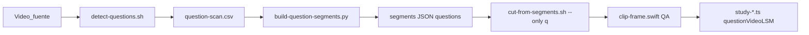

# Clips de pregunta LSM (`questionVideoLSM`)

Pipeline probado para generar los 12 clips cortos de pregunta señada a partir del video fuente LSM de un estudio. Los scripts viven en [`scripts/lsm/`](../../../scripts/lsm/) — no duplicar en esta carpeta.

## Regla crítica

Un clip de pregunta es **exactamente** el tramo donde aparece el círculo gris con **`?`** en la esquina **inferior-derecha** (presentador señando la pregunta).

**Prohibido** usar como proxy:
- Referencias bíblicas en top-left (ej. "Proverbios 18:24")
- Cambios de número de párrafo en top-left
- Inicios de párrafo sin icono `?`

Errores frecuentes y diagnóstico: [`references/pitfalls.md`](references/pitfalls.md).

## Prerrequisitos

- Video fuente local (no commitear), ej. `~/Downloads/w_LSM_*.mp4`
- macOS con `swiftc`, `python3`, **`avconvert`** (ffmpeg opcional)
- `studyId` conocido (ej. `2026-06-29`)
- [`segments-{STUDY_ID}.json`](../../../scripts/lsm/segments-2026-06-29.json) con `paragraphs[]` (párrafos ya detectados o en curso)
- Carpeta destino: `public/videos/study-{STUDY_ID}/`

## Pipeline



### Variables

```bash
export STUDY_ID="2026-06-29"
export SOURCE="/path/to/w_LSM_source.mp4"
export SEGMENTS="scripts/lsm/segments-${STUDY_ID}.json"
export OUT_DIR="public/videos/study-${STUDY_ID}"
```

### 1. Detectar tramos y actualizar JSON

```bash
# Editar SEGMENTS en detect-questions.sh si hace falta otro estudio
bash scripts/lsm/detect-questions.sh "$SOURCE"
```

Equivalente manual:

```bash
swiftc -O -o scripts/lsm/detect-question-icon \
  scripts/lsm/detect-question-icon.swift \
  -framework AVFoundation -framework AppKit

scripts/lsm/detect-question-icon "$SOURCE" scripts/lsm/question-scan.csv 18
python3 scripts/lsm/build-question-segments.py scripts/lsm/question-scan.csv "$SEGMENTS"
```

### 2. Recortar clips de pregunta

```bash
rm -f "${OUT_DIR}"/*q*.mp4   # obligatorio si re-recortas (cut-from-segments omite existentes)
bash scripts/lsm/cut-from-segments.sh "$SEGMENTS" "$SOURCE" --only q:1-17
```

Recorte parcial:

```bash
bash scripts/lsm/cut-from-segments.sh "$SEGMENTS" "$SOURCE" --only q:12-13
```

### 3. QA visual

```bash
swiftc -O -o scripts/lsm/clip-frame scripts/lsm/clip-frame.swift \
  -framework AVFoundation -framework AppKit

scripts/lsm/clip-frame "${OUT_DIR}/study-${STUDY_ID}-q01-lsm.mp4" /tmp/q01-qa.png
# Debe verse el ? en esquina inferior-derecha
```

## Tabla de scripts

| Script | Entrada | Salida | Propósito |
|--------|---------|--------|-----------|
| `detect-question-icon.swift` | `SOURCE.mp4`, CSV, `[calibrateSecond]` | `question-scan.csv` | Escanea cada 0,5 s buscando `?` en bottom-right |
| `detect-questions.sh` | `SOURCE.mp4` | CSV + JSON actualizado | Compila, escanea, fusiona y valida duraciones 3–25 s |
| `build-question-segments.py` | CSV, `segments.json` | `questions[]` en JSON | Fusiona tramos consecutivos; asigna labels Q1…Q12 |
| `cut-from-segments.sh` | JSON, `SOURCE`, `[--only q:N-M]` | `q*.mp4` en `OUT_DIR` | Recorta con `avconvert` |
| `clip-frame.swift` | clip `.mp4`, PNG | imagen QA | Frame al 50 % para verificar `?` |

### Detalles del detector

| Parámetro | Valor |
|-----------|-------|
| Recorte del icono | Origen `(86% ancho, 82% alto)`; tamaño `12% × 12%` (cuadrado) |
| Calibración | Segundo de referencia **18 s** (≈ Q1 con `?`) |
| Umbral | `max(800, score_calibración × 0,45)` |
| Exclusión intro | Segundos 0–13,5 ignorados (panel lateral) |
| Validación | Cada tramo debe durar **3–25 s** |

## Enjambre de agentes (9 subagentes)

El agente principal **orquesta** subagentes `Task`. Usar este desglose en estudios nuevos o re-recortes masivos.

| Agente | Rol | Entregable | Dependencias |
|--------|-----|------------|--------------|
| **Q1** | Compilar detector y ejecutar `detect-questions.sh` | `question-scan.csv` | — |
| **Q2** | Validar 12 tramos y duraciones 3–25 s | Reporte OK/BAD por pregunta | Q1 |
| **Q3** | Verificar `questions[]` vs preguntas en `study-*.ts` | JSON + tabla start/end | Q2 |
| **Q4** | Recortar `q01`–`q03` | 3 mp4 | Q3 |
| **Q5** | Recortar `q04`–`q06` | 3 mp4 | Q3 |
| **Q6** | Recortar `q07`–`q09` | 3 mp4 | Q3 |
| **Q7** | Recortar `q10`–`q12` | 3 mp4 | Q3 |
| **Q8** | QA visual: `clip-frame.swift` al 50 % de cada clip | 12 pass/fail | Q4–Q7 |
| **Q9** | Inventario, `npm run build`, rutas `questionVideoLSM` | Checklist cerrado | Q8 |

### Reglas de orquestación

1. **Q1 → Q2 → Q3** secuenciales. Detener si ≠12 tramos o algún `[BAD]`.
2. **Q4 + Q5 + Q6 + Q7** en **un solo mensaje** (4 Task paralelos) tras Q3.
3. **Q8 → Q9** al final, secuenciales.
4. Antes de Q4–Q7: `rm -f "${OUT_DIR}"/*q*.mp4` si re-recortas.

### Prompts tipo (copiar al lanzar Task)

**Q1:** Compila `detect-question-icon` y ejecuta `detect-questions.sh` con SOURCE para `{STUDY_ID}`. Devuelve ruta del CSV.

**Q2:** Valida `questions[]` en `segments-{STUDY_ID}.json`: deben ser 12 tramos, cada uno 3–25 s. Tabla inicio/fin/duración con OK/BAD.

**Q3:** Compara los 12 tramos del JSON con las preguntas en `data/articles/study-{STUDY_ID}.ts`. Confirma mapeo Q_LABELS.

**Q4:** `rm` clips q viejos si aplica. `cut-from-segments.sh --only q:1-3`. Lista archivos generados.

**Q5:** `cut-from-segments.sh --only q:4-6`. Lista archivos.

**Q6:** `cut-from-segments.sh --only q:7-9`. Lista archivos.

**Q7:** `cut-from-segments.sh --only q:10-12`. Lista archivos (incluye q12-q13, q14-q15, q16, q17 según convención).

**Q8:** Extrae frame al 50 % de cada `q*.mp4`. Confirma `?` visible; marca FAIL si hay párrafo o ref bíblica sin `?`.

**Q9:** Inventario final (12 clips), verifica `questionVideoLSM` en TS, ejecuta `npm run build`. Resumen listo para commit (sin commitear).

## Cableado en datos

Campo en cada pregunta de `data/articles/study-YYYY-MM-DD.ts`:

```typescript
questionVideoLSM: "/videos/study-2026-06-29/study-2026-06-29-q01-lsm.mp4"
```

Pregunta agrupada (convive con `videoLSM` unido de párrafos):

```typescript
{
  number: "3, 4",
  questionVideoLSM: "/videos/study-2026-06-29/study-2026-06-29-q3-q4-lsm.mp4",
  videoLSM: "/videos/study-2026-06-29/study-2026-06-29-p03-p04-lsm.mp4",
  paragraphs: [3, 4],
}
```

| Campo | Uso |
|-------|-----|
| `questionVideoLSM` | Clip corto (3–15 s) — solo pregunta señada con `?` |
| `question.videoLSM` | Clip unido de párrafos (2+ párrafos) |
| `paragraph.videoLSM` | Clip individual por párrafo |

### Mapeo clip ↔ pregunta (`Q_LABELS`)

12 archivos cubren 17 preguntas impresas cuando hay bloques agrupados:

| Clip | Label JSON | `number` en TS | Archivo |
|------|------------|----------------|---------|
| q01 | `"1"` | `"1"` | `…-q01-lsm.mp4` |
| q02 | `"2"` | `"2"` | `…-q02-lsm.mp4` |
| q03 | `"3-4"` | `"3, 4"` | `…-q3-q4-lsm.mp4` |
| q04 | `"5"` | `"5"` | `…-q05-lsm.mp4` |
| q05 | `"6-7"` | `"6, 7"` | `…-q6-q7-lsm.mp4` |
| q06 | `"8-9"` | `"8, 9"` | `…-q8-q9-lsm.mp4` |
| q07 | `"10"` | `"10"` | `…-q10-lsm.mp4` |
| q08 | `"11"` | `"11"` | `…-q11-lsm.mp4` |
| q09 | `"12-13"` | `"12, 13"` | `…-q12-q13-lsm.mp4` |
| q10 | `"14-15"` | `"14, 15"` | `…-q14-q15-lsm.mp4` |
| q11 | `"16"` | `"16"` | `…-q16-lsm.mp4` |
| q12 | `"17"` | `"17"` | `…-q17-lsm.mp4` |

Rutas en TS: prefijo `/videos/…` (sin `public/`). Preguntas agrupadas: `q{N}-q{M}` sin cero inicial.

## Ejemplo real: `study-2026-06-29`

| Pregunta | Inicio | Fin | Duración | Archivo |
|----------|--------|-----|----------|---------|
| 1 | 51,5 s | 54,5 s | 3,0 s | `…-q01-lsm.mp4` |
| 2 | 89,0 s | 94,0 s | 5,0 s | `…-q02-lsm.mp4` |
| 3-4 | 137,5 s | 142,5 s | 5,0 s | `…-q3-q4-lsm.mp4` |
| 5 | 178,0 s | 182,0 s | 4,0 s | `…-q05-lsm.mp4` |
| 6-7 | 259,0 s | 265,5 s | 6,5 s | `…-q6-q7-lsm.mp4` |
| 8-9 | 336,0 s | 341,5 s | 5,5 s | `…-q8-q9-lsm.mp4` |
| 10 | 370,0 s | 374,5 s | 4,5 s | `…-q10-lsm.mp4` |
| 11 | 400,0 s | 406,0 s | 6,0 s | `…-q11-lsm.mp4` |
| 12-13 | 522,5 s | 543,0 s | 20,5 s | `…-q12-q13-lsm.mp4` |
| 14-15 | 663,5 s | 666,5 s | 3,0 s | `…-q14-q15-lsm.mp4` |
| 16 | 716,0 s | 726,0 s | 10,0 s | `…-q16-lsm.mp4` |
| 17 | 789,0 s | 797,5 s | 8,5 s | `…-q17-lsm.mp4` |

## Checklist de cierre

- [ ] `detect-questions.sh` reporta 12 segmentos; validación 3–25 s sin `[BAD]`
- [ ] 12 archivos `q*.mp4` en `OUT_DIR` (sin clips viejos tras re-corte)
- [ ] Cada clip muestra `?` en frame al 50 %
- [ ] Las 17 preguntas tienen `questionVideoLSM` según tabla de mapeo
- [ ] Clips de párrafo (`p01`…`p17`) siguen presentes
- [ ] `npm run build` sin errores
- [ ] No commitear video fuente ni mp4 salvo orden explícita del usuario

## Relacionado

- Convenciones generales de videos LSM: skill [`lsm-video`](../lsm-video/SKILL.md)
- Ciclo de vida del estudio: skill [`study-lifecycle`](../study-lifecycle/SKILL.md)
